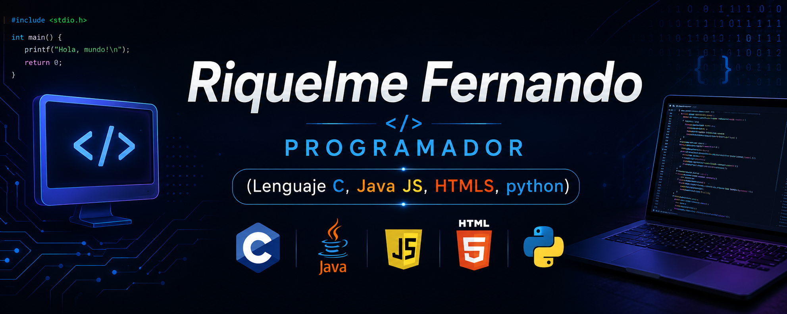

<!-- ╔══════════════════════════════════════════════════════════════╗ -->

<!--                         BANNER                                -->

<!-- ╚══════════════════════════════════════════════════════════════╝ -->

<p align="center">
  
</p>

<br>

<!-- ╔══════════════════════════════════════════════════════════════╗ -->

<!--                         INTRO                                 -->

<!-- ╚══════════════════════════════════════════════════════════════╝ -->

<div align="center">

# 👋 Hola, soy Fernando Riquelme

### 💻 Programador en formación | Desarrollo de Software

**Apasionado por la programación, la tecnología y el aprendizaje constante.**

<br>

[](TU_GITHUB)
[](TU_LINKEDIN)
[](TU_INSTAGRAM)
[](TU_DISCORD)

</div>

<br>

---

<!-- ╔══════════════════════════════════════════════════════════════╗ -->

<!--                       SOBRE MÍ                                -->

<!-- ╚══════════════════════════════════════════════════════════════╝ -->

## 🧑‍💻 Sobre mí

```c
#include <stdio.h>

int main() {

    printf("Hola, soy Fernando Riquelme\n");
    printf("Soy programador en formación.\n");
    printf("Siempre aprendiendo algo nuevo.\n");

    return 0;
}
```

🎯 Mi objetivo es seguir creciendo como desarrollador y adquirir experiencia creando proyectos reales.

🌱 Actualmente estoy fortaleciendo mis conocimientos en diferentes lenguajes y herramientas de programación.

💡 Me interesa especialmente aprender, experimentar y transformar ideas en proyectos funcionales.

📚 Siempre estoy buscando nuevos desafíos que me permitan mejorar mis habilidades.

---

<!-- ╔══════════════════════════════════════════════════════════════╗ -->

<!--                    TECNOLOGÍAS                                -->

<!-- ╚══════════════════════════════════════════════════════════════╝ -->

## 🛠️ Tecnologías y herramientas

<div align="center">

### 💻 Lenguajes


<br><br>

### 🧰 Herramientas


</div>

<br>

|       Tecnología      | Nivel de experiencia |
| :-------------------: | :------------------: |
|          🔵 C         |      Aprendiendo     |
|         ☕ Java        |      Aprendiendo     |
|     🟨 JavaScript     |      Aprendiendo     |
|        🌐 HTML5       |      Aprendiendo     |
|         🎨 CSS        |      Aprendiendo     |
|       🐍 Python       |      Aprendiendo     |
| 💙 Visual Studio Code |     Uso habitual     |
|       💬 Discord      |     Uso habitual     |

---

<!-- ╔══════════════════════════════════════════════════════════════╗ -->

<!--                       OBJETIVOS                                -->

<!-- ╚══════════════════════════════════════════════════════════════╝ -->

## 🚀 Actualmente

```text
📚 Aprendiendo programación
│
├── 💻 C
├── ☕ Java
├── 🟨 JavaScript
├── 🌐 HTML5
├── 🎨 CSS
└── 🐍 Python
```

### 🎯 Mis objetivos

* 📖 Seguir mejorando mis conocimientos de programación.
* 🧠 Aprender nuevas tecnologías y herramientas.
* 🛠️ Crear proyectos personales.
* 💼 Adquirir experiencia como desarrollador.
* 🚀 Construir proyectos cada vez más completos.

---

<!-- ╔══════════════════════════════════════════════════════════════╗ -->

<!--                       PROYECTOS                                -->

<!-- ╚══════════════════════════════════════════════════════════════╝ -->

## 📂 Proyectos

<div align="center">

### 🚧 Próximamente...

> Esta sección se irá actualizando a medida que publique nuevos proyectos.

</div>

---

<!-- ╔══════════════════════════════════════════════════════════════╗ -->

<!--                       CONTACTO                                -->

<!-- ╚══════════════════════════════════════════════════════════════╝ -->

## 🤝 Conectá conmigo

<div align="center">

<a href="TU_LINKEDIN" target="_blank">

</a>

   

<a href="TU_INSTAGRAM" target="_blank">

</a>

   

<a href="TU_DISCORD" target="_blank">

</a>

<br><br>

**¡No dudes en contactarme! 👋**

</div>

<br>

---

<div align="center">

### 💻 `while(alive) { code(); learn(); repeat(); }`

<br>

⭐ **Gracias por visitar mi perfil**

</div>

<!-- ╔══════════════════════════════════════════════════════════════╗ -->

<!--                         FOOTER                                -->

<!-- ╚══════════════════════════════════════════════════════════════╝ -->


